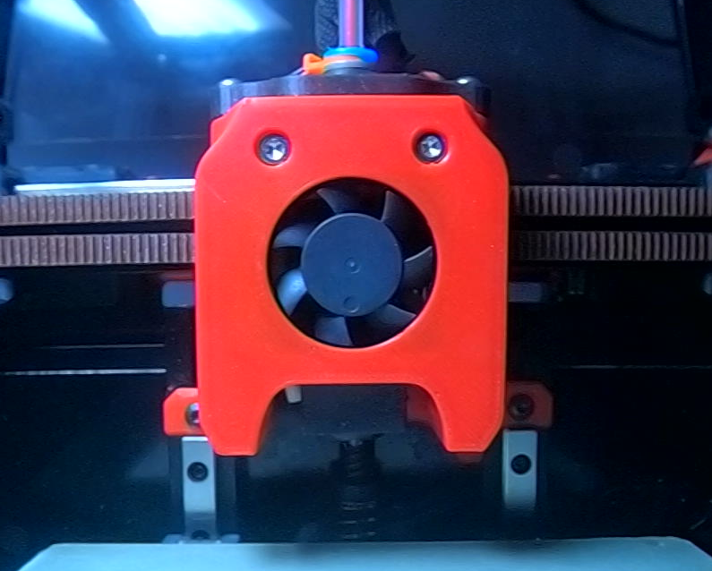

# Mini-AfterSherpa

The Mini-AfterSherpa is an alternate toolhead for Voron V0.1 and similar printers that use the V0.1-style X carriage. It offers flexibility and additional choice with additional convenience.

## Direct-drive extruders
With the Mini-AfterSherpa, you can choose from multiple direct-drive extruders. 

- [Sherpa Mini](https://github.com/Annex-Engineering/Sherpa_Mini-Extruder)
- [Sailfin](https://github.com/CroXY3D/Sailfin-Extruder)
- [Orbiter V1.5/V2.0](https://www.thingiverse.com/thing:4725897)
- [Pocketwatch V2](https://github.com/VoronDesign/Pocket-Watch)
- [Jetpack](https://github.com/VoronDesign/Jetpack-Extruder)

## Bowden setups

Or, instead, you can use a [Bowden adapter](https://github.com/Annex-Engineering/Sherpa_Mini-Extruder/tree/master/Toolheads/Hartk1213_Bowden_Adapter_Voron0) to pair the Mini-AfterSherpa with any standard 1.75mm-filament Bowden extruder.

## Hotends

Currently supported hotends include the Dragon and the Dragonfly BMO.

## Zip tie slots

The Mini-AfterSherpa includes two slots for zip ties to aid in cable management and strain relief. They're much easier to access and route cables through than the zip tie slots on the X carriage (and if you're using an aluminum X carriage like the one from Funssor, then it doesn't even _have_ any zip tie slots!)

Made by [Kyrios](https://github.com/KurioHonoo), based on the [AfterSherpa by smolboi](https://www.thingiverse.com/thing:4977800).