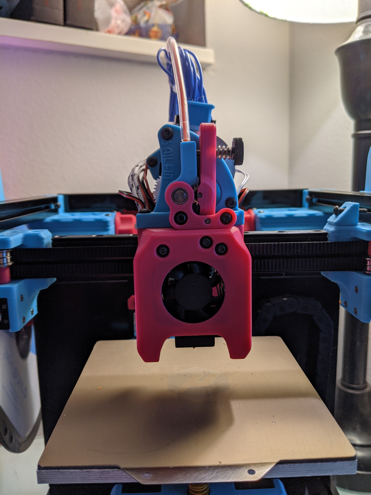
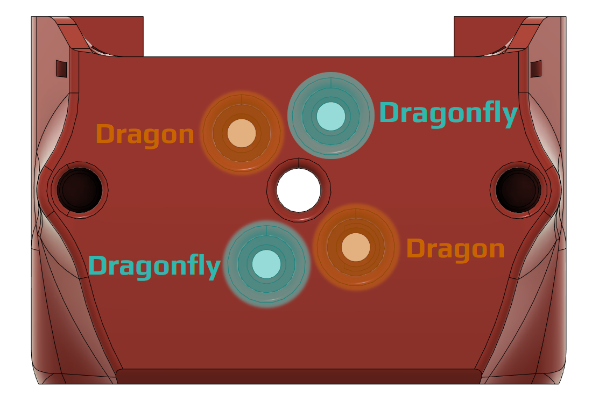

# Mini-AfterSherpa

The Mini-AfterSherpa is an alternate toolhead for Voron V0.1 and similar printers ([Micron](https://github.com/hartk1213/micron), [Flying Zero](https://github.com/zruncho3d/f-zero), [Salad Fork](https://github.com/YeriWyn/Salad_Fork), etc) that use the Mini-Afterburner-style X carriage. It offers flexibility and extruder choice with additional convenience.

## Features

### Direct-drive extruders

With the Mini-AfterSherpa, you can choose from multiple direct-drive extruders.

- [Sherpa Mini](https://github.com/Annex-Engineering/Sherpa_Mini-Extruder)
- [Sailfin](https://github.com/CroXY3D/Sailfin-Extruder)
- [Orbiter V1.5/V2.0](https://www.thingiverse.com/thing:4725897) (coming soon)
- [Pocketwatch V2](https://github.com/VoronDesign/Pocket-Watch) (coming soon)
- [Jetpack](https://github.com/VoronDesign/Jetpack-Extruder) (coming soon)

### Bowden setups

Or, instead, you can use a [Bowden adapter](https://github.com/Annex-Engineering/Sherpa_Mini-Extruder/tree/master/Toolheads/Hartk1213_Bowden_Adapter_Voron0) to pair the Mini-AfterSherpa with any standard 1.75mm-filament Bowden extruder, including the [Voron M4](https://github.com/VoronDesign/Mobius-Extruder/).

### Hotends

Currently supported hotends include the Dragon and the Dragonfly BMO.

### Zip tie slots

The Mini-AfterSherpa includes two slots for zip ties to aid in cable management and strain relief. They're much easier to access and route cables through than the zip tie slots on the X carriage (and if you're using an aluminum X carriage like the one from Funssor, then it doesn't even _have_ any zip tie slots!)

## Assembly

### BOM

- 2×: M2.5×8mm BHCS/SHCS (to connect the hotend)
- 2×: M3×5×4mm heatset inserts (to connect the extruder or Bowden adapter)
- 3×: M3×35mm FHCS, BHCS, or SHCS
- 2×: 3010 blower fans (same as Mini-Afterburner)
- 1×: 3007 axial fan (same as Mini-Afterburner)

For Bowden setups:

- 1×: ECAS04 Bowden collet and clip
- 1×: 2mm innner diameter/4mm outer diameter PTFE tubing, 25mm long

### Instructions

1. Install both heatset inserts on the holes far to the sides of the top of the Mini-AfterSherpa.
1. Install fans following the instructions on [page 109 of the V0.1 manual](https://github.com/VoronDesign/Voron-0/raw/Voron0.1/Manuals/Assembly_Manual_0.1.pdf).
1. Install the hotend using the M2.5×8mm bolts, using the following diagram to determine which holes to use for your hotend.
   
1. Attach the Mini-AfterSherpa to your X carriage with the M3×35mm bolts, routing the hotend wires to either side of the toolhead.
1. Use zip ties to secure the wires on the sides.  
   
1. Install your extruder or Bowden adapter.

# To-Do

### WIP

## About

Made by [Kyrios](https://github.com/KurioHonoo), based on the [AfterSherpa by smolboi](https://www.thingiverse.com/thing:4977800).
